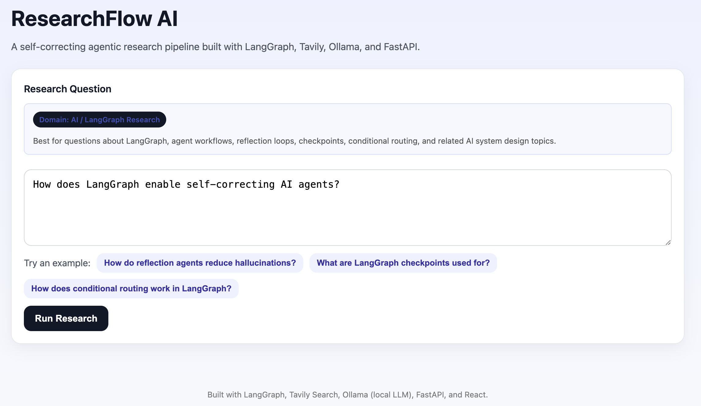

# ResearchFlow AI

A **self-correcting agentic research pipeline** built with **LangGraph, Tavily Search, Ollama (local LLM), FastAPI, and React**.

ResearchFlow AI demonstrates how modern AI systems can **decompose complex questions, retrieve web evidence, verify relevance, and synthesize citation-grounded answers** using a structured multi-step workflow.

---


---

# Demo



Research workflow:

```
User Question
     ↓
Research Plan
     ↓
Sub-Question Generation
     ↓
Web Search (Tavily)
     ↓
Evidence Verification
     ↓
Answer Synthesis
```

The system produces:

- a structured research plan  
- decomposed sub-questions  
- verified evidence sources  
- citation-grounded final answers  

---

# Why This Project Matters

Single-prompt LLM systems often suffer from:

- hallucinated answers  
- missing evidence  
- weak reasoning chains  

ResearchFlow AI addresses these issues by implementing a **self-correcting agent architecture**.

The system:

- breaks complex questions into research tasks  
- retrieves evidence from the web  
- verifies evidence quality  
- synthesizes answers grounded in sources  

This demonstrates how **agent orchestration frameworks like LangGraph can improve reliability in AI systems.**

---

# Key Features

## Agentic Research Workflow

The system follows a structured **multi-step AI pipeline**:

```
Question
   ↓
Planner Node
   ↓
Sub-Question Generator
   ↓
Search Node (Tavily)
   ↓
Verifier Node
   ↓
Synthesizer Node
```

Each node performs a **specialized reasoning task**, coordinated through **LangGraph orchestration**.

---

## Self-Correcting Architecture

The system includes mechanisms for improving answer reliability:

- evidence verification  
- confidence scoring  
- reflection notes  
- retry capability when evidence quality is low  

This introduces **reflection-aware reasoning**, a key concept in agentic AI systems.

---

## Source-Grounded Answers

Answers are generated **only from retrieved evidence** and include citations.

Example:

```
Direct answer:

• LangGraph enables self-correcting AI agents through cyclical workflows where an agent generates output, evaluates results, and loops back for revision.

• It maintains shared state and checkpoints so intermediate results persist across iterations.

• Conditional routing allows workflows to retry, revise, or terminate execution based on intermediate outcomes.

Limitation: LangGraph provides orchestration infrastructure, but evaluation logic must still be implemented by the developer.
```

---

## Transparent Research Trace

Every research run produces a visible reasoning trace:

1. Question  
2. Plan  
3. Sub-questions  
4. Evidence verification  
5. Reflection / retry  
6. Final synthesis  

This provides **observability into the agent’s reasoning pipeline**.

---

# System Architecture

```
User Question
     │
     ▼
Planner Node
Generates research plan
     │
     ▼
Question Decomposition
Creates sub-questions
     │
     ▼
Search Node
Retrieves evidence using Tavily
     │
     ▼
Verifier Node
Evaluates evidence relevance
     │
     ▼
Synthesizer Node
Generates citation-grounded answer
```

This architecture demonstrates **agentic AI system design** where multiple reasoning modules collaborate to produce reliable outputs.

---

# Technology Stack

## AI & Agent Frameworks

- **LangGraph** — workflow orchestration for AI agents  
- **Ollama** — local LLM inference  
- **Tavily Search API** — web evidence retrieval  

## Backend

- **FastAPI**
- Python
- Async processing

## Frontend

- **React**
- Axios
- Responsive UI

---

# Why LangGraph?

LangGraph was selected because it provides primitives for building **stateful AI agents**.

Key capabilities used in this project:

- **Stateful workflows** — shared research state across nodes  
- **Conditional routing** — retry or revise steps based on evidence quality  
- **Modular reasoning nodes** — planner, search, verification, synthesis  
- **Agent orchestration** — structured reasoning pipelines rather than single prompts  

This enables building **reliable multi-step AI systems instead of simple LLM wrappers.**

---

# Engineering Challenges

Building a reliable AI research agent required solving several challenges.

### Evidence Quality

Web search often returns noisy or partially relevant information.  
A verifier node evaluates retrieved evidence and assigns a confidence score.

### Hallucination Prevention

The synthesizer is restricted to generate answers **only from retrieved evidence**, reducing hallucinated responses.

### Agent Coordination

LangGraph manages orchestration between planner, search, verification, and synthesis nodes using shared workflow state.

### Adaptive Research

If evidence quality is low, the system can retry research with refined sub-questions.

---

# Example Query

```
How does LangGraph enable self-correcting AI agents?
```

The system will:

1. Generate a research plan  
2. Decompose the question  
3. Retrieve technical documentation  
4. Verify evidence relevance  
5. Generate a cited final answer  

---

# Running the Project

## 1. Clone the Repository

```
git clone https://github.com/your-username/researchflow-ai.git
cd researchflow-ai
```

---

## 2. Backend Setup

Create a Python environment:

```
python -m venv .venv
source .venv/bin/activate
```

Install dependencies:

```
pip install -r requirements.txt
```

Run the backend:

```
uvicorn app.main:app --reload
```

Backend will run at:

```
http://127.0.0.1:8000
```

---

## 3. Frontend Setup

Navigate to the frontend directory:

```
cd frontend
```

Install dependencies:

```
npm install
```

Run the frontend:

```
npm start
```

Open the application:

```
http://localhost:3000
```

---

# Project Structure

```
researchflow-ai
│
├── backend
│   ├── app
│   │   ├── graph
│   │   │   ├── planner.py
│   │   │   ├── decomposer.py
│   │   │   ├── search.py
│   │   │   ├── verifier.py
│   │   │   └── synthesizer.py
│   │   │
│   │   ├── services
│   │   │   └── ollama_client.py
│   │   │
│   │   └── main.py
│
├── frontend
│   ├── src
│   │   ├── App.jsx
│   │   └── App.css
│
├── docs
│   ├── researchflow-demo.png
│   └── architecture.png
│
└── README.md
```

---

# Engineering Concepts Demonstrated

This project demonstrates practical experience with:

- agentic AI workflows  
- LangGraph orchestration  
- retrieval-augmented reasoning  
- evidence verification pipelines  
- reflection-aware research agents  
- LLM reliability strategies  
- full-stack AI system development  

---

# Future Improvements

Possible enhancements:

- vector database retrieval  
- semantic search ranking  
- LangSmith observability integration  
- multi-agent collaboration  
- workflow visualization  

---

# Author

Krishna Koushik Unnam  
Software Engineer | AI Systems Developer