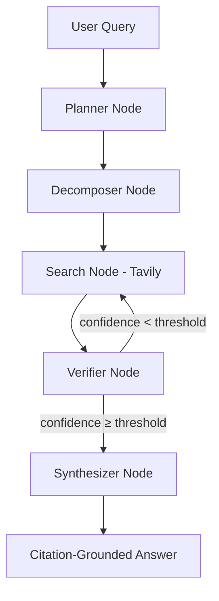

# ResearchFlow AI 🔍
### Self-Correcting Agentic Research Pipeline · LangGraph + FastAPI + Ollama

[](https://python.org)
[](https://github.com/langchain-ai/langgraph)
[](https://fastapi.tiangolo.com)
[](https://reactjs.org)
[](https://ollama.com)
[](https://tavily.com)
[](LICENSE)

> **ResearchFlow AI** is a production-grade agentic research system that decomposes complex questions into sub-queries, retrieves and verifies web evidence, and synthesizes citation-grounded answers — with self-correcting retry logic when evidence quality is low.

---

## 🎬 Demo


> *Ask any complex research question — ResearchFlow decomposes it, searches for evidence, verifies quality, and returns a cited answer with a full reasoning trace.*

---

## ✨ What Makes This Different from a RAG Chatbot

Most LLM apps do: `question → retrieve → answer`

ResearchFlow does:
```
question → decompose → search → verify confidence →
  if low: re-search with refined query (cyclic retry) →
answer with citations + reasoning trace
```

This is **agentic reasoning** — the system evaluates its own evidence quality and decides whether to retry before synthesizing. Single-prompt LLM systems hallucinate. ResearchFlow verifies.

---

## 🏗️ Architecture



### Node Responsibilities

| Node | Role |
|------|------|
| **Planner** | Analyzes query intent, defines research strategy |
| **Decomposer** | Breaks complex question into focused sub-queries |
| **Search** | Retrieves web evidence via Tavily Search API |
| **Verifier** | Scores evidence relevance and confidence (0–1) |
| **Synthesizer** | Generates final answer with inline citations |

The **cyclic edge** between Verifier and Search is the core innovation — if confidence falls below threshold, the system refines the query and searches again rather than hallucinating from weak evidence.

---

## 🔬 Example

**Query:** *"How does LangGraph enable self-correcting AI agents?"*

**Pipeline trace:**
```
[Planner]     → Strategy: technical documentation + recent examples
[Decomposer]  → Sub-queries: ["LangGraph cyclic workflow", 
                               "LangGraph conditional routing",
                               "LangGraph stateful agents retry"]
[Search]      → Retrieved 9 sources via Tavily
[Verifier]    → Confidence: 0.44 (below threshold) → RETRY
[Search]      → Refined query: "LangGraph self-correction checkpointing 2024"
[Verifier]    → Confidence: 0.83 → PASS
[Synthesizer] → Answer with 5 inline citations
```

**Sample output:**
```
• LangGraph enables self-correcting agents through cyclical workflows where
  an agent generates output, evaluates results, and loops back for revision.

• It maintains shared state and checkpoints so intermediate results persist
  across iterations.

• Conditional routing allows workflows to retry, revise, or terminate
  execution based on intermediate outcomes.

Limitation: LangGraph provides orchestration infrastructure, but evaluation
logic must still be implemented by the developer.
```

---

## 🚀 Quick Start

### Prerequisites
- Python 3.10+
- [Ollama](https://ollama.com) running locally with Llama 3.2: `ollama pull llama3.2`
- Tavily API key (free tier at [tavily.com](https://tavily.com))

### Installation

```bash
git clone https://github.com/krishnakoushik225/langgraph-research-agent
cd langgraph-research-agent
python -m venv .venv
source .venv/bin/activate   # Windows: .venv\Scripts\activate
pip install -r requirements.txt
```

### Environment Setup

```bash
cp .env.example .env
# Add your keys:
# TAVILY_API_KEY=your_key_here
# LANGSMITH_API_KEY=your_key_here   (optional, for tracing)
```

### Run

```bash
# Backend
uvicorn app.main:app --reload
# Runs at http://127.0.0.1:8000

# Frontend (separate terminal)
cd frontend && npm install && npm start
# Runs at http://localhost:3000
```

---

## 🛠️ Tech Stack

| Layer | Technology |
|-------|-----------|
| Agent Orchestration | LangGraph (cyclic state machine) |
| LLM Backend | Ollama + Llama 3.2 (local, private) |
| Web Search | Tavily Search API |
| API Backend | FastAPI (async) |
| Frontend | React + Axios |
| Observability | LangSmith (optional tracing) |

---

## 📁 Project Structure

```
langgraph-research-agent/
├── backend/
│   └── app/
│       ├── graph/
│       │   ├── planner.py        # Research strategy generation
│       │   ├── decomposer.py     # Sub-question generation
│       │   ├── search.py         # Tavily evidence retrieval
│       │   ├── verifier.py       # Confidence scoring + retry logic
│       │   └── synthesizer.py    # Citation-grounded answer generation
│       ├── services/
│       │   └── ollama_client.py  # Local LLM client
│       └── main.py               # FastAPI entrypoint
├── frontend/
│   └── src/
│       ├── App.jsx
│       └── App.css
├── docs/
│   ├── researchflow-demo.png
│   └── architecture.png
├── .env.example
├── requirements.txt
└── README.md
```

---

## ⚙️ Engineering Challenges Solved

**Evidence Quality** — Web search returns noisy results. The Verifier node assigns a confidence score and triggers re-search with refined queries when quality is low.

**Hallucination Prevention** — The Synthesizer is constrained to generate answers only from retrieved evidence, with every claim linked to a source.

**Agent Coordination** — LangGraph manages shared workflow state across all nodes, enabling conditional branching and retry without losing intermediate results.

**Adaptive Research** — If initial sub-questions yield weak evidence, the system reformulates them before attempting synthesis.

---

## 💡 Why LangGraph?

LangGraph was chosen specifically because it supports **cyclic graphs** — standard LangChain chains are DAGs (directed acyclic graphs) and cannot model retry loops. LangGraph enables:

- **Stateful workflows** — shared research state persists across all nodes
- **Conditional routing** — retry, revise, or terminate based on verifier output
- **Modular reasoning nodes** — each node has a single, testable responsibility
- **Checkpointing** — intermediate results survive failures and restarts

---

## 🔭 Roadmap

- [ ] LangSmith full trace dashboard
- [ ] Human-in-the-loop checkpoint before synthesis
- [ ] Vector database retrieval (Pinecone) as additional search source
- [ ] Streaming tokens to frontend in real-time
- [ ] Multi-model support (GPT-4, Claude, Gemini)
- [ ] Multi-agent collaboration mode

---

## 📄 License

MIT — free to use and build on.

---

*Built by [Krishna Koushik Unnam](https://github.com/krishnakoushik225) · AI Systems Developer*